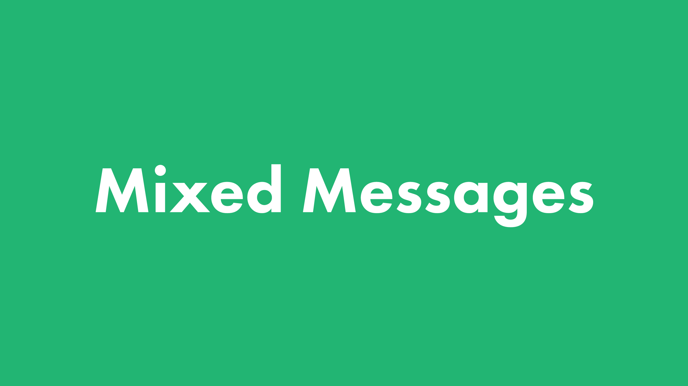

# Mixed Messages

## Table of contents

- [General info](#general-info)
- [Screenshots](#screenshots)
- [Technologies](#technologies)
- [Setup](#setup)
- [Features](#features)
- [Status](#status)
- [Inspiration](#inspiration)
- [Contact](#contact)

---

## General info

Mixed Messages is a music quote generator. Every time you run the program the user will get a new, randomized 'quote' from a famous jazz musician. All 'quotes' are for fun and are not based on fact.

[Back to top](#mixed-messages)

---

## Screenshots

[Back to top](#mixed-messages)

---

## Technologies

- [Git](https://git-scm.com)
- [Node](https://nodejs.org/en/)
- [Javascript](https://developer.mozilla.org/en-US/docs/Web/JavaScript)

[Back to top](#mixed-messages)

---

## Setup

- Clone the repo

[Back to top](#mixed-messages)

---

## Features

To-do list:

- [ ] Plan your project
- [ ] Come Up with a Topic
- [ ] Create script and run it locally
- [ ] Set up version control
- [ ] Store message components
- [ ] Create the message
- [ ] Put the program together
- [ ] Next Steps

[Back to top](#mixed-messages)

---

## Status

Project is: _in progress_

[Back to top](#mixed-messages)

---

## Inspiration

Add here credits. Project based on challenge set by [Codecademy](https://www.codecademy.com/)

[Back to top](#mixed-messages)

---

## Contact

Created by [@bryansmullen](https://github.com/bryansmullen) - feel free to contact me!

[Back to top](#mixed-messages)
